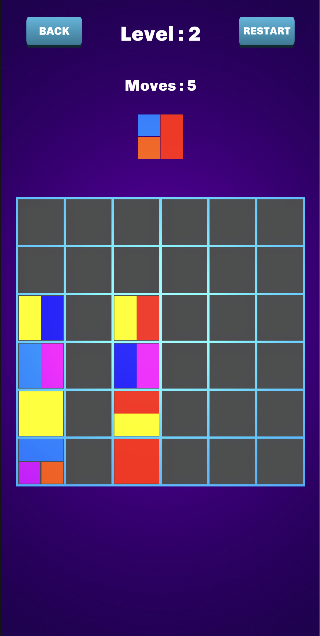

# Drop Jelly Clone

A Unity-based puzzle game inspired by Drop Jelly, featuring colorful block matching mechanics and physics-based gameplay.

## Overview

Drop Jelly Clone is a prototype puzzle game where players match colorful jelly blocks to clear the board. The game features 3 playable levels, with mechanics focused on strategic block placement and color matching.

## Features

- **Intuitive Block Placement**: Drag and drop jelly blocks onto the game board
- **Color Matching**: Match blocks of the same color to clear them from the board
- **Dynamic Block Expansion**: Blocks expand and connect to form bigger shapes
- **Physics-Based Interactions**: Realistic falling and stacking behaviors
- **Progression System**: 3 unique levels with increasing complexity
- **Responsive UI**: Clean user interface with move counters and level information

## Gameplay

The objective is to clear all blocks from the board by strategically placing new pieces. Each level provides a limited number of moves, challenging players to think ahead and plan their strategy.

Key mechanics:
- Match blocks of the same color that touch each other to clear them
- Connected blocks of the same color will all be cleared when one is matched
- When all blocks of the same color in a square formation connect, they become a "Big Square"
- Big Squares can clear many blocks at once when matched with the same color

## Technical Details

### Development Environment
- **Engine**: Unity 2022.3.55
- **Language**: C#
- **Architecture**: Component-based with event-driven systems
- **Animation**: DoTween for smooth transitions and effects

### Code Structure
- **Managers**: Handles game state, UI, board flow, and data
- **Block System**: Controls block behavior, connections, and interactions
- **Board**: Manages grid positioning, gravity, and block registration
- **UI**: Event-based interface system with animated feedback

## Installation

1. Clone this repository
2. Open the project with Unity 2022.3.55 or later
3. Open the `MenuScene` scene in the `Assets/_Scenes` folder
4. Press Play to run the game in the editor

## Building the Game

1. Open the project in Unity
2. Go to File > Build Settings
3. Add the necessary scenes to the build
4. Choose your target platform
5. Click Build or Build and Run

## Controls

- **Mouse/Touch**: Drag blocks horizontally to position them
- **Release**: Drop the block into the current column

## Future Improvements

While this is a prototype with 3 playable levels, the architecture supports easy expansion:
- Additional levels with new block configurations
- New jelly block types with special abilities
- Power-ups and special moves
- Score system and leaderboards
- Improved visual effects and animations

## Credits

- Inspired by Drop Jelly
- Created with Unity 2022.3.55
- DoTween animation library by Daniele Giardini
